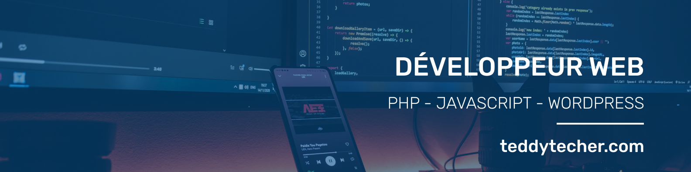
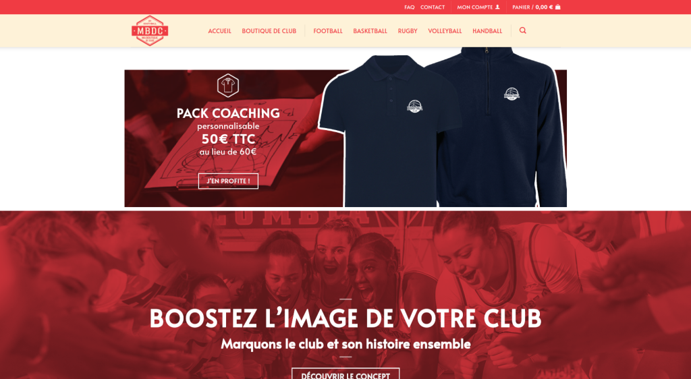
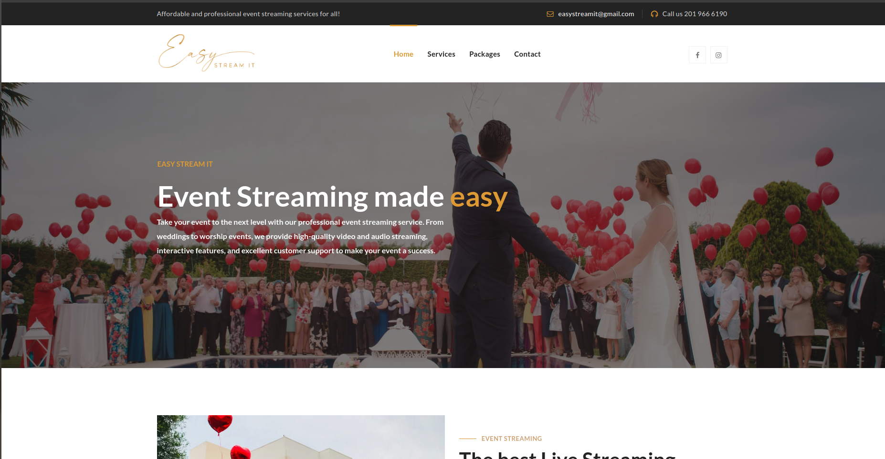

# About Me

 
    <b>Welcome!</b>
      My name is <b>Teddy</b>,
      Junior Developer & WordPress Developer
      from
    <b> France </b>
    

<h3>I Code with :</h3>

    
    
    
    
    
    
    
    
    
    
    
    
    
    
    
    
    

    
  

<h3>I Design with :</h3>

  

<h3>My Projects :</h3>

  Create with <b>CMS Wordpress</b> :

  - E-commerce Website : <a href="https://www.maboutiquedeclub.com/" target = "_blank">Maboutiquedeclub.com</a>
  - 
  - Marketing Digital & Coaching Website : <a href="https://solve.fr/" target = "_blank">Solve.fr</a>
  - 
  - Event Streaming Service Website <a href="https://easystreamit.com/" target = "_blank">Easystreamit.com</a>
  - 

